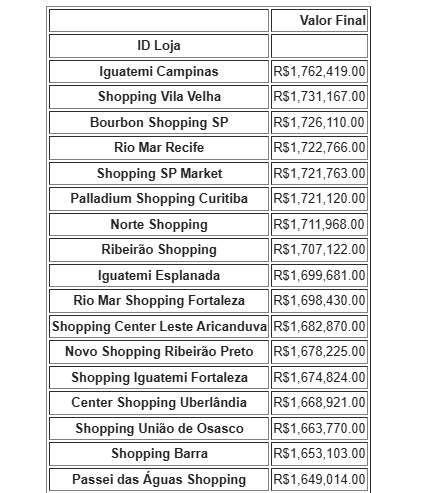

<h1 align="center">Análise de Vendas</h1>

 Análise sobre as vendas de vários Shoppings Centers ao redor do país. 

  <a href="#-tecnologias">Tecnologias</a>&nbsp;&nbsp;&nbsp;|&nbsp;&nbsp;&nbsp;
  <a href="#-projeto">Projeto</a>&nbsp;&nbsp;&nbsp;|&nbsp;&nbsp;&nbsp;
  <a href="#-aprendizado">Aprendizado</a>&nbsp;&nbsp;&nbsp;|&nbsp;&nbsp;&nbsp;
  <a href="#-licença">Licença</a>

  

 

  

---
## 🚀 Tecnologias

Esse projeto foi desenvolvido com as seguintes tecnologias:

- Python
- Pandas
- PyWin32
- Excel

---
## 💻 Projeto

Projeto de análise de dados, onde foram analisados os dados de vendas e faturamento de diversos produtos de 25 Shoppings Centers ao redor do país, enviando um relatório por e-mail mostrando o faturamento, ticket médio e quantidade de produtos vendidos em cada shopping center.

---
## 📑 Aprendizado

Durante esse projeto aprendi: 
- Importar e usar libs utilizando pip
- Importar e ler dados, arquivos externos com o Pandas
- Criar nova tabela(DataFrame) com Pandas 
- Tratar e compilar os dados importados
- Enviar emails automatizados com o Python, utilizando a lib PyWin32

---
## 📝 Licença

Esse projeto está sob a licença MIT.

---